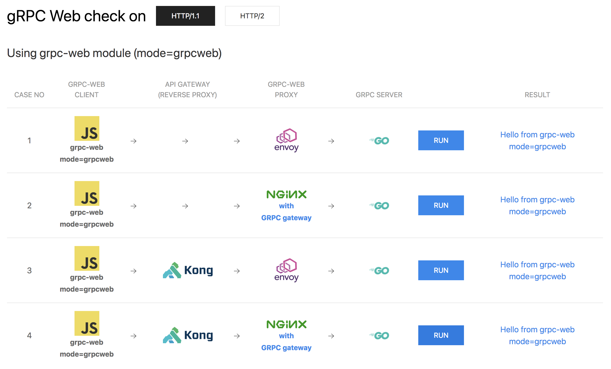
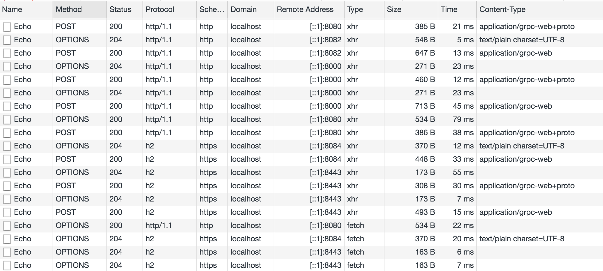

# Checking gRPC Web on localhost

This project is a project to check gRPC Web on localhost



### 1. Create a docker image of nginx including GRPC gateway module

```
git clone https://github.com/grpc/grpc-web.git
cd grpc-web
git checkout -b 1.0.4 refs/tags/1.0.4
docker-compose -f advanced.yml build prereqs
docker-compose -f advanced.yml build nginx
```
It takes a long time to build. Please wait for a while.

### 2. Run cassandra for kong on docker

```
git clone https://github.com/betchi/grpc-web-local.git
cd grpc-web-local
docker network create grpc-web-test

tar -zxvf kong-database.tar.gz

docker run -d --rm --name kong-database \
  --network grpc-web-test \
  -p 9042:9042 \
  -v  `pwd`/kong-database:/var/lib/cassandra \
  cassandra:3.11.3
```

Startup is completed when the message `Starting listening for CQL clients on /0.0.0.0:9042` is displayed. 

The necessary data already exists.

Proceed to the next step.

### 3. Run gRPC Web check tool

```
docker-compose up
```

## Check in the browser

Please access the following URL in the browser

`http://localhost:8081`

You will be requested by clicking the RUN button in each case.

You should also check the network panel of the browser's developer tool.



## How to customize Protocol Buffers

### 1. Edit proto file

Edit `./proto/echo.proto`

### 2. Build compiler (build docker image)

```
make build-protobuf-builder
```

### 3. Compile proto file (use docker image)

```
make build-protobuf
```

### 4. Edit grpc server program (use docker image)

Edit `go-server/main.go`

Then build docker image with the following command

```
make build-go-server
```

### 5. Edit gRPC Web client program


Edit the following file

* `ts-client/src/grpc-web.ts`
* `ts-client/src/grpc-web-text.ts`
* `ts-client/src/grpc-web-client.ts`

then bundle assets with Parcel

```
# if not installed
yarn global add parcel-bundler

make bundle
```

### 6. Run gRPC Web check tool

```
docker-compose up
```


---


The logo used in this project is as follows

* https://blog.golang.org/go-brand
* https://github.com/envoyproxy/artwork
* https://github.com/voodootikigod/logo.js
* https://konghq.com/brand/
* https://nginx.org/